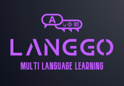

    

## Multi-Language Translation Tool

Google Translate API offers a wide array of foreign languages for translation. All 64 below. 
One of my favorite Youtubers has amassed an incredible skill in not only learning new languages, but being able to switch to another language at the drop of the hat in conversation, even further gaining the ability to speak rare, remote languages. This has repeatedly inspired me to attempt to learn new foreign languages.
Below is his Youtube Channel Link:
[@xiomannyc](https://www.youtube.com/@xiaomanyc)

Google Translate already does translation work, so why would anyone need Langgo? Langgo is a project and experiment in pursuit of MULTIPLE LANGUAGE TRANSLATION simultaneously. User inputs one word or phrase, Langgo outputs to many languages. Repetition is key, and training your brain this method is extremely effective.
I had attempted to build one such application while in school that was limited to six languages, built in vanilla javascript, but was slow and had little adaptability to user needs. Langgo will hopefully help others in their language journey with many updates planned ahead!

### Google Translation API

1. afrikaans
2. albanian
3. arabic
4. azerbaijani
5. basque
6. belarusian
7. bengali
8. bulgarian
9. catalan
10. chinese_simplified
11. chinese_traditional
12. croatian
13. czech
14. danish
15. dutch
16. english
17. esperanto
18. estonian
19. filipino
20. finnish
21. french
22. galician
23. georgian
24. cgerman
25. greek
26. gujarati
27. haitian_creole
28. hebrew
29. hindi
30. hungarian
31. icelandic
32. indonesian
33. irish
34. italian
35. japanese
36. kannada
37. korean
38. latin
39. latvian
40. lithuanian
41. macedonian
42. malay
43. maltese
44. norwegian
45. persian
46. polish
47. portuguese
48. romanian
49. russian
50. serbian
51. slovak
52. slovenian
53. spanish
54. swahili
55. swedish
56. tamil
57. telugu
58. thai
59. turkish
60. ukrainian
61. urdu
62. vietnamese
63. welsh
64. yiddish